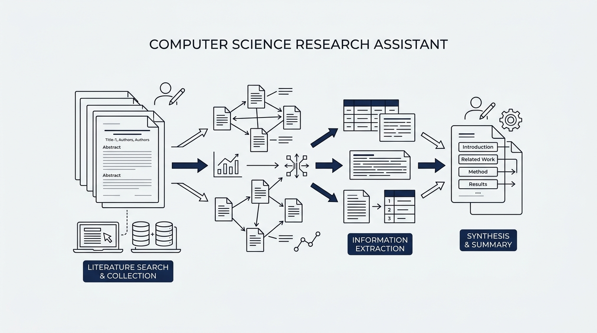
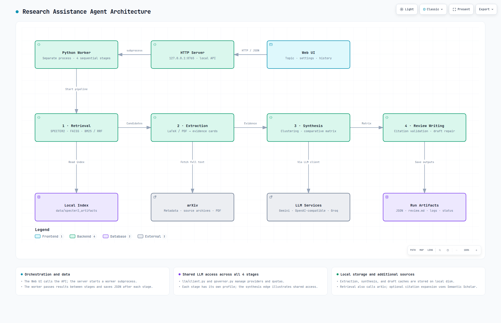
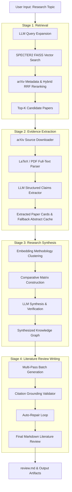

# 🔬 Research Assistance Agent

<div align="center">

[](https://www.python.org/)
[](https://huggingface.co/allenai/specter2_base)
[](https://deepmind.google/technologies/gemini/)
[](http://127.0.0.1:8765)
[](LICENSE)

**An autonomous, local-first research pipeline that transforms scientific topics into comprehensive, grounded, and fully cited literature reviews.**

[Key Features](#-key-features) • [Architecture](#-pipeline-architecture) • [Quick Start](#-quick-start--web-interface) • [UI Configuration Guide](#%EF%B8%8F-complete-ui-configuration-guide) • [Results & Artifacts](#-results--artifacts) • [Developer Setup](#%EF%B8%8F-developer-setup--installation)

</div>

---

## 🌟 Key Features

- **⚡ Autonomous 4-Stage Pipeline**: Seamlessly handles **Retrieval → Evidence Extraction → Research Synthesis → Review Writing**.
- **🧠 Semantic Neural Search**: Uses **AllenAI SPECTER2** embeddings + FAISS vector search combined with BM25 hybrid ranking and query expansion to retrieve relevant scientific literature.
- **📄 Full-Text Source Parsing**: Downloads and extracts LaTeX source archives (`.tar.gz`) or PDFs from arXiv to parse claims, methodologies, and exact evidentiary quotes.
- **🛡️ Strict Grounding & Citation Alignment**: Validates every synthesized claim against raw paper content, preventing LLM hallucinations and generating inline bib-style references `[Author, Year]`.
- **🎛️ Per-Stage LLM Provider Routing**: Route each pipeline stage independently to **Google Gemini**, **OpenAI / OpenAI-Compatible endpoints**, or **Groq**, with stage-specific models, credentials, endpoints, and rate-limit quotas. Selecting a provider locks that stage to it, avoiding silent cross-provider fallback.
- **🌐 Privacy-Preserving Local UI Workspace**: Modern two-column web workspace (`127.0.0.1:8765`) with real-time terminal logs, a Markdown review preview with 1-click copy, downloadable output artifacts, and run history navigation. All credentials are stored locally with owner-only file permissions (`0600`).
- **🌍 Multilingual Interface & Output**: Bilingual Web UI (English / Vietnamese) with separate control over the target language of the generated literature review document (`en` or `vi`).
- **🌗 Persistent Light & Dark Themes**: Switch between light and dark modes from the header; the browser remembers the selected theme and interface language for future sessions.

---

## 🏗️ Pipeline Architecture

### System architecture

The local Web UI calls a loopback HTTP API, which starts an isolated Python worker. The worker runs retrieval, extraction, synthesis, and review writing sequentially, saving structured results after each stage. All four stages share the LLM client and quota governor, with independent provider settings per stage.



**Interactive diagrams:** [English](docs/architecture/system-architecture.en.html) · [Tiếng Việt](docs/architecture/system-architecture.html). Download an HTML file and open it in a browser to use zoom, search, theme switching, and export; GitHub displays HTML source rather than running the viewer.

**Editable Archify specifications:** [English JSON](docs/architecture/system-architecture.en.json) · [Vietnamese JSON](docs/architecture/system-architecture.json). Diagram content is available in both languages; viewer controls use English.

### Pipeline flow

The pipeline processes research requests through four sequential, decoupled stages. Each stage saves its structured state as JSON before passing evidence to the next.



### Stage Summary Breakdown

| Stage | Name | Input | Output | Main Technologies |
| :--- | :--- | :--- | :--- | :--- |
| **Stage 1** | **Retrieval** | Topic string & filters | Ranked list of `top_k` papers | SPECTER2, FAISS, PyTorch, BM25, Reciprocal Rank Fusion |
| **Stage 2** | **Extraction** | Candidate paper IDs | Structured evidence & claim cards | arXiv API, LaTeX parser, PyPDF, LLM extraction prompt |
| **Stage 3** | **Synthesis** | Extracted paper cards | Methodology clusters & comparative matrix | TF-IDF / Cosine clustering, LLM matrix synthesis |
| **Stage 4** | **Writing** | Synthesis matrix & cards | Markdown review (`review.md`) | Multi-pass LLM generation, Citation validator, Auto-repair |

---

## 🚀 Quick Start & Web Interface

### 1. Launching via Double-Click (Linux)
On Linux desktop environments, double-click **`Research Assistant.desktop`** in the project root directory.
If prompted by your OS, choose **Allow Launching**. The launcher will initialize the virtual environment (`.venv`) and automatically launch the web interface at:

👉 **[http://127.0.0.1:8765](http://127.0.0.1:8765)**

*(Keep the terminal/launcher window open while using the application).*

### 2. Launching via Command Line
Alternatively, launch the UI server using your terminal:

```bash
# Using the python launcher script
.venv/bin/python launch_ui.py

# Or using the installed CLI entry point
.venv/bin/python -m research_assistant.ui.server --port 8765
```

> [!NOTE]
> The server listens strictly on local loopback (`127.0.0.1`). API keys and settings are read from and saved to `.env`.

### 3. Pre-built SPECTER2 Data Download
To run local vector retrieval without generating embeddings from scratch, download the pre-computed SPECTER2 dataset:

📥 **[Download Pre-built SPECTER2 Artifacts (Google Drive)](https://drive.google.com/file/d/1Jyh-wA6AkJEMtzwz7YyjEeHhqfH0v906/view?usp=sharing)**

Extract the downloaded package into `data/specter2_artifacts/` within the project root directory:

```bash
mkdir -p data/specter2_artifacts
# Unpack the downloaded archive into data/specter2_artifacts/
```

Verify that `data/specter2_artifacts/manifest.json` exists before running the pipeline.

### 4. Interactive Web Workspace

The Web UI features an interactive dashboard split into two main sections:

- **Setup Panel (Left)**:
  - **Quick Parameters**: Input research topic, candidate paper count (`top_k`), output review language (`en`/`vi`), word count target, and SPECTER2 directory.
  - **API & .env Configuration**: Set global API provider keys (Gemini, OpenAI, Groq) and default rate limit quotas.
  - **Stage Configuration (Advanced)**: Customize low-level stage parameters and select a dedicated **LLM provider, model, credentials, endpoint, and quota profile** for each stage.
- **Progress & Results Panel (Right)**:
  - 📊 **Pipeline Progress**: Follow all four stages, inspect warnings, and stop an active run.
  - 📜 **Literature Review Tab**: Preview the generated `review.md` and copy its complete Markdown source with one click.
  - 🪵 **Terminal Log Tab**: Real-time log streaming from pipeline execution with auto-scroll and download (`run.log`).
  - 📁 **Output Files Tab**: Direct download grid for stage artifacts (`stage-1-retrieval.json` through `stage-4-writing.json`, `review.md`, `config.json`, `run.log`).
  - 📜 **Research History Tab**: Browse, refresh, and inspect past research execution runs.
- **Header Controls**: Switch the UI between Vietnamese and English independently of the review output language, and choose a persistent light or dark theme.

---

## 🎛️ Complete UI Configuration Guide

The web application exposes both high-level project controls and granular Python dataclass parameters. Below is a complete reference guide for every configuration parameter in the UI.

---

### 1. Quick Research Setup (Top Panel)

These essential fields control the core target of your research session:

| UI Field / Parameter | Python Variable | Type | Default | Description & Guidance |
| :--- | :--- | :--- | :--- | :--- |
| **Research topic** | `topic` | `str` | *Required* | High-level topic, problem statement, or methodology to research (1 to 2,000 characters). **Example**: *"Retrieval-augmented generation for scientific literature review"*. |
| **Number of papers** | `retrieval.top_k` | `int` | `25` | The target number of candidate papers selected by Stage 1 to pass to evidence extraction. Higher values yield broader reviews but increase LLM processing time. |
| **Review language** | `writing.language` | `select` | `vi` (UI) / `en` | Target language for the written output review (`en` for English, `vi` for Vietnamese). *Note: UI language switch (VI/EN in top right) controls interface text; this setting controls the output document language.* |
| **Target word count** | `writing.target_words` | `int` | `1500` | Target word length for the final literature review document. |
| **SPECTER2 data directory** | `retrieval.artifacts_dir` | `path` | `data/specter2_artifacts` | Path to directory containing pre-computed SPECTER2 embeddings, FAISS vector index, and `manifest.json`. ([Download pre-built artifacts](https://drive.google.com/file/d/1Jyh-wA6AkJEMtzwz7YyjEeHhqfH0v906/view?usp=sharing)). |

---

### 2. API & `.env` Provider Settings

Click **API & .env configuration** to expand API keys, model selections, and rate limit quotas.

> [!IMPORTANT]
> **API Key Privacy**: Saved API keys are never transmitted back from the server to the browser frontend. Leaving a saved API key field blank will retain the existing saved key. Check **Delete saved key** and click **Save .env configuration** to remove a stored key.

#### A. LLM Rate Limit Quotas (Required when LLMs are enabled)
To prevent API rate limit crashes (HTTP 429 errors), the pipeline uses token-bucket quota management. You must input your API tier's limits:

- **`LLM_RPM`** *(Requests / Minute)*: Maximum API calls permitted per minute across active providers.
- **`LLM_TPM`** *(Tokens / Minute)*: Maximum token throughput allowed per minute.
- **`LLM_RPD`** *(Requests / Day)*: Maximum total daily request cap.
- **`LLM_QUOTA_GROUP`**: Optional logical group name for sharing rate limit state files across multiple worker instances.
- **`LLM_STATE_DIR`**: Directory path for storing persistent quota token-bucket state.

#### B. LLM Provider Credentials & Models

| Provider | Key Variable | Model Variable (`.env`) | Default Model | Custom Endpoint |
| :--- | :--- | :--- | :--- | :--- |
| **Google Gemini** | `GEMINI_API_KEY` | `GEMINI_MODEL` | `gemini-2.5-flash` | — |
| **OpenAI** | `OPENAI_API_KEY` | `OPENAI_MODEL` | `gpt-4o-mini` | `OPENAI_BASE_URL` (Default: `https://api.openai.com/v1`) |
| **Groq** | `GROQ_API_KEY` | `GROQ_MODEL` | `llama-3.1-8b-instant` | — |
| **Semantic Scholar**| `SEMANTIC_SCHOLAR_API_KEY` | — | — | Boosts metadata rate limits |

> [!TIP]
> **OpenAI-Compatible Local Models**: You can connect local LLM engines (such as vLLM, Ollama, or LM Studio) by setting `OPENAI_BASE_URL` to your local server URL (e.g. `http://localhost:11434/v1`) and specifying your local model name in `OPENAI_MODEL`.

#### C. Per-Stage LLM Provider Routing & Model Selection

Each pipeline stage (**Retrieval**, **Extraction**, **Synthesis**, **Review Writing**) can be independently routed to **Groq**, **OpenAI**, or **Gemini**.

- **Granular Override Form**: Selecting a provider expands its stage-specific API key, model, quota group, RPM/TPM/RPD limits, and—for OpenAI-compatible services—Base URL fields.
- **Selected-Provider Inheritance**: A blank stage field inherits the corresponding global setting for the selected provider. The stage remains locked to that provider and does not silently fall back to another one.
- **Environment Variable Format**: Stage-specific settings are persisted in `.env` using the format `RA_<STAGE>_LLM_PROVIDER` and `RA_<STAGE>_<PROVIDER>_<FIELD>`:
  - Example: `RA_WRITING_LLM_PROVIDER=openai`, `RA_WRITING_OPENAI_MODEL=gpt-4o-mini`, `RA_EXTRACTION_GEMINI_API_KEY=...`
- **Quota Grouping**: `RA_<STAGE>_<PROVIDER>_LLM_QUOTA_GROUP` lets stages share or separate token-bucket state. Use separate groups only for API accounts or keys with independent limits.
- **Validation**: Before a run starts, the UI verifies that the selected provider has an effective API key and that RPM, TPM, and RPD quotas are present and positive.
- **API Key Security**: Global and stage-specific keys are masked in the Web UI, never returned to the browser, and omitted from run artifacts such as `config.json`.

Supported stage profile variables:

```text
RA_<STAGE>_LLM_PROVIDER
RA_<STAGE>_<PROVIDER>_API_KEY
RA_<STAGE>_<PROVIDER>_MODEL
RA_<STAGE>_OPENAI_BASE_URL
RA_<STAGE>_<PROVIDER>_LLM_RPM
RA_<STAGE>_<PROVIDER>_LLM_TPM
RA_<STAGE>_<PROVIDER>_LLM_RPD
RA_<STAGE>_<PROVIDER>_LLM_QUOTA_GROUP
```

`<STAGE>` is `RETRIEVAL`, `EXTRACTION`, `SYNTHESIS`, or `WRITING`; `<PROVIDER>` is `GROQ`, `OPENAI`, or `GEMINI`.

---

### 3. Advanced Stage Configurations

Expand **Stage configuration (Advanced)** in the UI to customize low-level stage execution parameters. Variable names correspond directly to Python dataclasses (`RA_<STAGE>_<VARIABLE>`).

---

#### Stage 1: Retrieval Configuration (`RetrievalConfig`)

Controls semantic vector search, query expansion, arXiv fetching, and candidate reranking.

```
Env Prefix: RA_RETRIEVAL_
```

| Parameter | Type | Default | Description |
| :--- | :--- | :--- | :--- |
| `artifacts_dir` | `path` | `data/specter2_artifacts` | Path to directory containing SPECTER2 FAISS index and paper shards. |
| `broad_k` | `int` | `150` | Number of FAISS nearest neighbors pulled per expanded query variant before candidate deduplication. |
| `candidate_pool_size` | `int` | `200` | Cap on deduplicated candidate papers before reranking (`top_k` must be $\le$ `candidate_pool_size`). |
| `top_k` | `int` | `25` | Final paper count handed over to Stage 2 Extraction. |
| `n_query_variants` | `int` | `4` | Number of topic variations generated by LLM to expand search coverage. |
| `use_rerank` | `bool` | `True` | Enables cosine similarity reranking of paper embeddings against topic vector. |
| `use_hybrid` | `bool` | `True` | Combines dense vector retrieval scores with keyword BM25 scores using Reciprocal Rank Fusion (RRF). |
| `use_citations` | `bool` | `False` | Enables citation graph traversal to pull heavily cited references. |
| `rrf_k` | `int` | `60` | Smoothing constant $k$ used in Reciprocal Rank Fusion formula: $\text{RRF Score} = \sum \frac{1}{k + r}$. |
| `year_from` | `int?` | `None` | Optional publication start year cutoff (e.g., `2020`). |
| `year_to` | `int?` | `None` | Optional publication end year cutoff (e.g., `2024`). |
| `categories` | `list` | `()` | Comma-separated list of arXiv categories to filter (e.g. `cs.CL, cs.AI, cs.LG`). |
| `device` | `select`| `"auto"` | PyTorch computing device (`auto`, `cpu`, `cuda`, `mps`). |
| `use_fp16` | `bool` | `True` | Uses half-precision FP16 floating point during SPECTER2 inference for speed and memory saving. |
| `llm_timeout_s` | `float`| `30.0` | Timeout in seconds for query expansion LLM requests. |
| `arxiv_keyword_n` | `int` | `50` | Number of papers fetched via arXiv API keyword search when supplementing corpus. |
| `rebuild_index_if_missing` | `bool` | `True` | Automatically rebuilds missing FAISS vector index binary if raw embeddings exist. |

---

#### Stage 2: Extraction Configuration (`ExtractionConfig`)

Controls raw LaTeX/PDF source unpacking, content parsing, and structured claim extraction.

```
Env Prefix: RA_EXTRACTION_
```

| Parameter | Type | Default | Description |
| :--- | :--- | :--- | :--- |
| `cache_dir` | `path` | `data/extraction_cache` | Cache directory storing extracted paper claim cards. |
| `prefer_provider` | `select`| `"gemini"` | Preferred LLM provider for extraction (`gemini`, `openai`, or `groq`). |
| `arxiv_delay_s` | `float`| `3.0` | Delay pause in seconds between web requests to arXiv. |
| `llm_concurrency` | `int` | `1` | Maximum parallel LLM extraction worker calls. |
| `max_retries` | `int` | `0` | Number of retry attempts on LLM request failure before fallback. |
| `llm_timeout_s` | `float`| `90.0` | Timeout per extraction LLM request (seconds). |
| `allow_abstract_fallback` | `bool` | `True` | Falls back to parsing abstract if full-text LaTeX/PDF source fetch fails. |
| `llm_batch_size` | `int` | `5` | Number of papers grouped into a single LLM extraction batch. |
| `max_llm_calls_per_run` | `int` | `6` | Upper limit on total LLM API calls in Stage 2 per run. |
| `llm_min_interval_s` | `float`| `5.0` | Forced minimum pause between LLM requests (seconds) to respect RPM quotas. |
| `pdf_on_parse_fail_only` | `bool` | `True` | Only attempts heavy PDF parsing if arXiv LaTeX `.tar.gz` source download fails. |
| `skip_llm_if_confident` | `bool` | `True` | Skips redundant LLM re-analysis if existing cached extraction is high confidence. |
| `include_related_work` | `bool` | `False` | Include "Related Work" sections in paper source text sent to LLM. |
| `include_appendix` | `bool` | `False` | Include appendix sections during full-text parsing. |
| `include_bibliography` | `bool` | `False` | Include bibliography reference list in source parsing. |
| `abstract_only` | `bool` | `False` | Restricts extraction strictly to abstracts, skipping full-text LaTeX/PDF parsing. |
| `max_input_chars` | `int` | `24000` | Maximum character length cap for paper text sent in an LLM prompt. |
| `max_input_tokens` | `int?` | `None` | Optional token limit for each extraction prompt; leave blank to use the character-based limit. |
| `max_tar_files` | `int` | `400` | Safety threshold for maximum extracted files in `.tar.gz` archives (zip bomb prevention). |
| `max_tar_bytes` | `int` | `80000000`| Maximum decompressed byte limit (80 MB) for paper archives. |
| `max_tar_nesting` | `int` | `8` | Maximum directory nesting depth allowed when unpacking `.tar.gz`. |
| `fetch_timeout_s` | `float`| `60.0` | HTTP network timeout limit for fetching arXiv source files. |

---

#### Stage 3: Synthesis Configuration (`SynthesisConfig`)

Controls methodology clustering, claim comparison matrix construction, and findings synthesis.

```
Env Prefix: RA_SYNTHESIS_
```

| Parameter | Type | Default | Description |
| :--- | :--- | :--- | :--- |
| `cache_dir` | `path` | `data/synthesis_cache` | Cache directory storing synthesis matrices. |
| `summarize` | `bool` | `True` (UI) / `False` | Enables LLM-driven research methodology clustering and comparative matrix synthesis. |
| `prefer_provider` | `select`| `"gemini"` | Preferred LLM provider for synthesis (`gemini`, `openai`, `groq`). |
| `strict_ok` | `bool` | `False` | Enforces strict validation check on synthesized claims. |
| `strict_evidence` | `bool` | `False` | Requires strict sentence-level verbatim quote alignment for every claim. |
| `distance_threshold` | `float`| `0.55` | Cosine distance distance threshold for methodology clustering. Lower values create tighter clusters. |
| `keyword_weight` | `float`| `0.5` | Balance weight between vector embedding similarity and TF-IDF keyword similarity (0.0 to 1.0). |
| `max_features` | `int` | `2000` | Vocabulary size limit for TF-IDF keyword extraction. |
| `use_cache` | `bool` | `True` | Reuses existing cached synthesis state if inputs match. |
| `llm_timeout_s` | `float`| `90.0` | Timeout in seconds for synthesis LLM generation calls. |
| `max_logical_calls` | `int` | `2` | Maximum logical LLM synthesis turns allowed. |
| `max_prompt_chars` | `int` | `24000` | Character ceiling for synthesis LLM prompt context. |
| `max_method_chars` | `int` | `800` | Maximum character length allocated per methodology summary card. |
| `max_problem_chars` | `int` | `400` | Maximum character length allocated per paper problem statement. |
| `max_claim_chars` | `int` | `300` | Maximum character limit per extracted scientific claim. |
| `max_claims_per_field` | `int` | `2` | Cap on extracted claims per category field. |
| `max_quote_chars` | `int` | `280` | Maximum character length allowed for verbatim quote evidence snippets. |

---

#### Stage 4: Writing Configuration (`WritingConfig`)

Controls structured Markdown review generation, citation verification, and self-correction.

```
Env Prefix: RA_WRITING_
```

| Parameter | Type | Default | Description |
| :--- | :--- | :--- | :--- |
| `cache_dir` | `path` | `data/writing_cache` | Directory path for storing written review draft caches. |
| `use_cache` | `bool` | `True` | Reuses a compatible cached writing result when available. |
| `use_llm` | `bool` | `True` (UI) / `False` | Enables LLM generation pass for writing the literature review. |
| `prefer_provider` | `select`| `"gemini"` | Preferred LLM provider for Stage 4 review writing (`gemini`, `openai`, `groq`). |
| `language` | `select`| `"vi"` (UI) / `"en"` | Document language for output review (`en` or `vi`). |
| `target_words` | `int` | `1500` | Target word count budget for the generated markdown paper review. |
| `max_generation_batches` | `int` | `3` | Maximum sequential generation passes (e.g. section drafting → synthesis expansion). |
| `max_repair_calls` | `int` | `1` | Maximum self-correction repair passes to fix ungrounded claims or formatting errors. |
| `max_http_attempts_per_run` | `int` | `5` | HTTP retry attempt limit for writing requests per run. |
| `max_run_tokens` | `int` | `100000` | Total cumulative token spending ceiling for Stage 4 execution. |
| `max_input_tokens` | `int` | `20000` | Maximum input prompt token limit per request. |
| `max_output_tokens` | `int` | `6000` | Maximum output generation token limit per response. |
| `context_tokens` | `int` | `32768` | Context window token budget for LLM calls. |
| `request_timeout_s` | `float`| `90.0` | Timeout limit in seconds for writing HTTP calls. |
| `run_deadline_s` | `float`| `600.0` | Total stage execution deadline limit (10 minutes). |

---

## 📁 Results & Artifacts

All run outputs are systematically saved to `results/ui/<run-id>/` directory:

```text
results/ui/<run-id>/
├── stage-1-retrieval.json   # Ranked candidate papers & query expansion variants
├── stage-2-extraction.json  # Extracted paper cards, evidence quotes & fallback notes
├── stage-3-synthesis.json   # Methodology clusters & comparative matrix
├── stage-4-writing.json     # Writing draft history & repair diagnostics
├── review.md                # 📜 Final literature review with inline citations
├── run.log                  # 🪵 Complete timestamped execution log (API keys masked)
├── config.json              # Snapshot of topic & parameters (credentials excluded)
└── status.json              # Stage progress status & timing statistics
```

---

## 🛠️ Developer Setup & Installation

### Environment Requirements
- **Python**: `>= 3.10`
- **Dependencies**: Declared in `pyproject.toml`
- **Corpus Data**: Pre-computed SPECTER2 FAISS index directory (`data/specter2_artifacts/`) containing `manifest.json`. 👉 **[Download specter2_artifacts (Google Drive)](https://drive.google.com/file/d/1Jyh-wA6AkJEMtzwz7YyjEeHhqfH0v906/view?usp=sharing)**

### 1. Installation

```bash
# Clone the repository
git clone https://github.com/DinhLiu/Research-AI-Assistance.git
cd Research-Assistance-Agent

# Create and activate virtual environment
python3 -m venv .venv
source .venv/bin/activate

# Install editable package with development tools
pip install -e '.[dev]'
```

### 2. Running Automated Tests

```bash
# Run unit & integration test suite (uses mock pipeline, zero real API quota consumed)
pytest -q
```

---

## 🗂️ Directory Structure

```text
Research-Assistance-Agent/
├── research_assistant/         # Core Python package
│   ├── retrieval/              # Stage 1: SPECTER2, FAISS & hybrid search
│   ├── extraction/             # Stage 2: arXiv source fetching & claim parser
│   ├── synthesis/              # Stage 3: Clustering & comparative matrix
│   ├── writing/                # Stage 4: Literature review drafting & validator
│   ├── llm/                    # Unified LLM provider client & rate limiter
│   ├── ui/                     # Web UI server, settings, worker & assets
│   └── config.py               # Central dataclass configuration defaults
├── data/                       # Local corpus, cache & token bucket state (git-ignored)
├── docs/                       # Design documents, guides & reports
│   └── assets/banner.jpg       # Project visual header asset
├── evaluation/                 # Benchmark evaluation notebooks & datasets
├── examples/                   # Single-stage CLI execution scripts
├── notebooks/                  # Kaggle / Colab SPECTER2 embedding scripts
├── results/                    # Generated run outputs & logs (git-ignored)
├── tests/                      # Pytest test suite & fixtures
├── launch_ui.py                # Standalone UI entry launcher
├── Research Assistant.desktop  # Linux double-click launcher
└── pyproject.toml              # Project dependencies & build settings
```

---

## 📜 License

This project is licensed under the Apache 2.0 License - see the [LICENSE](LICENSE) file for details.
